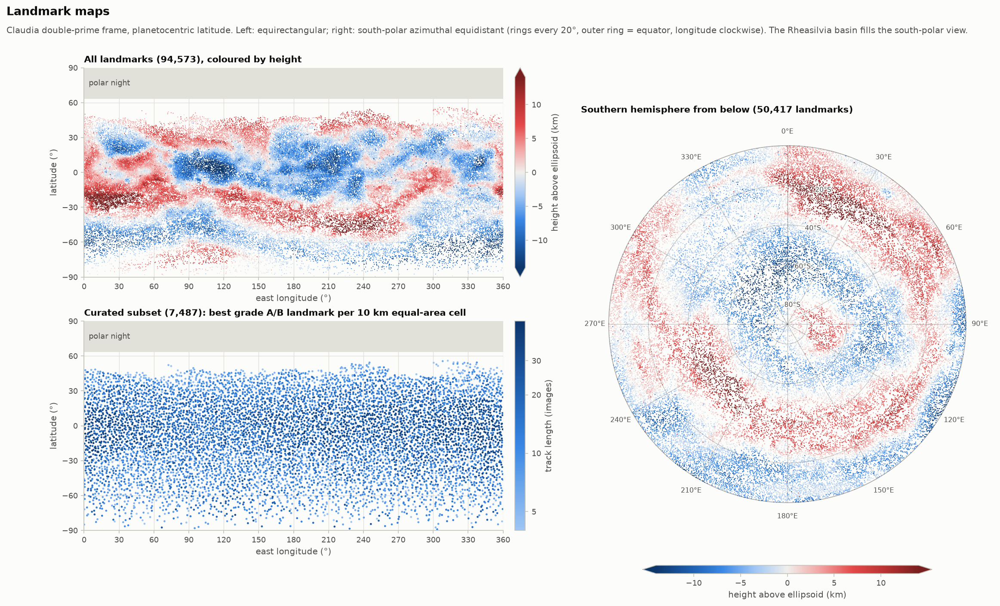
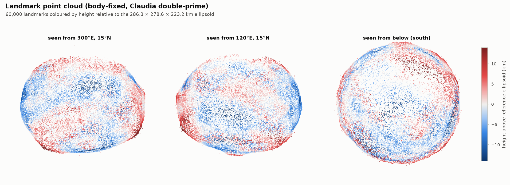
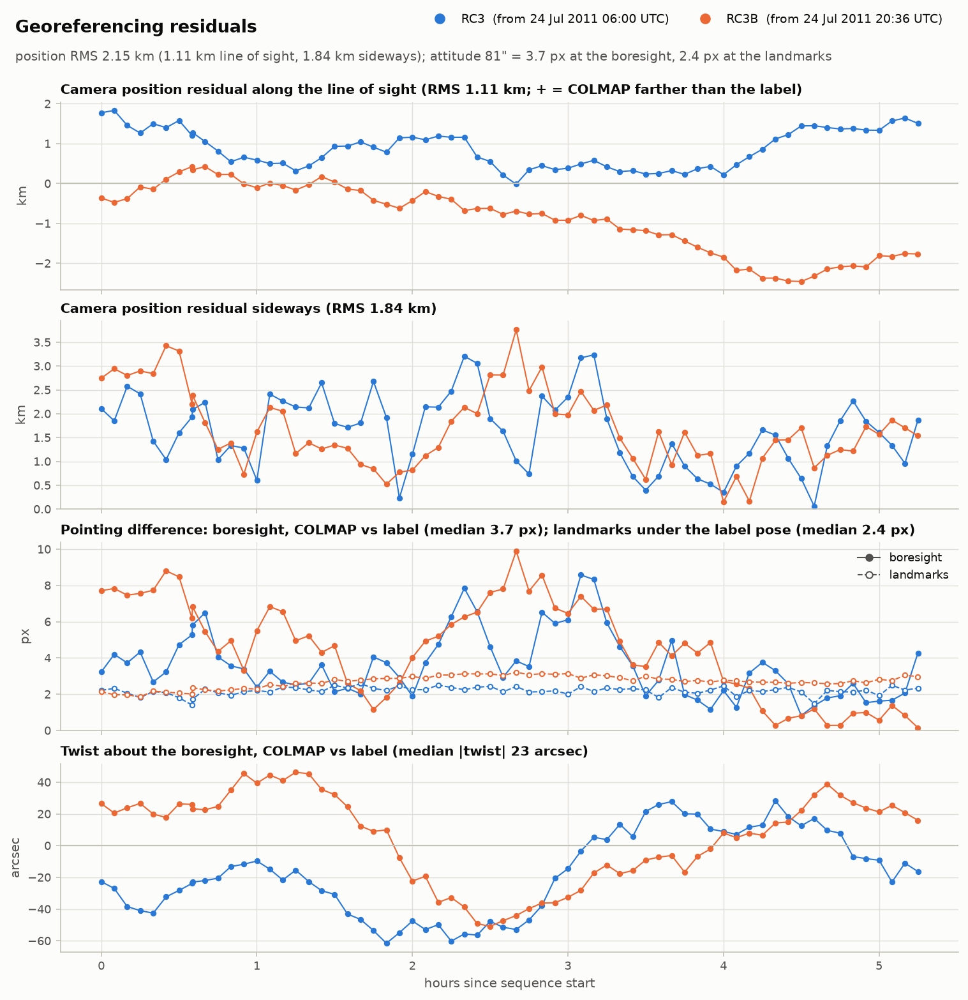
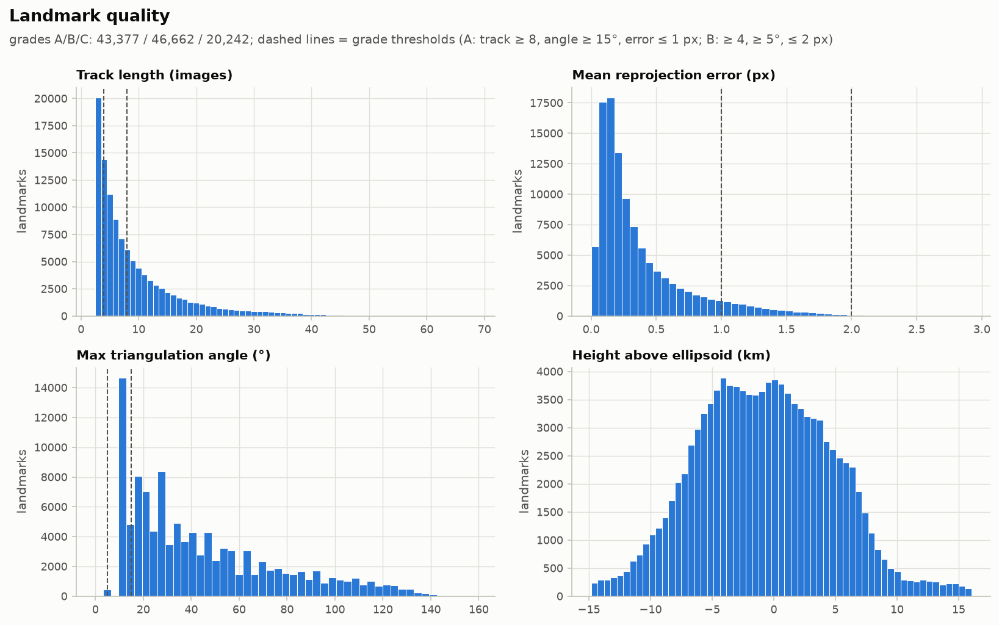
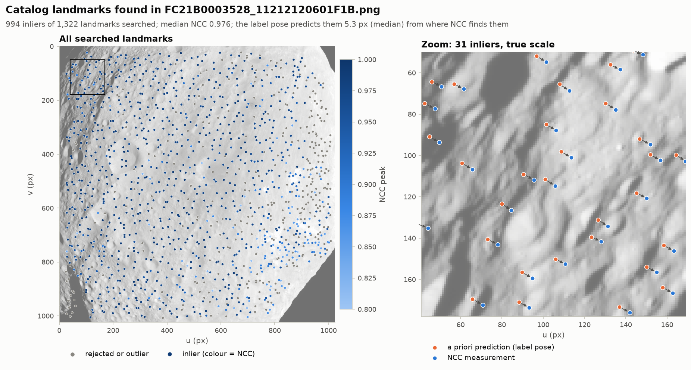
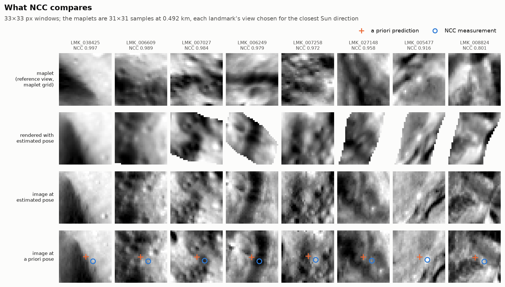
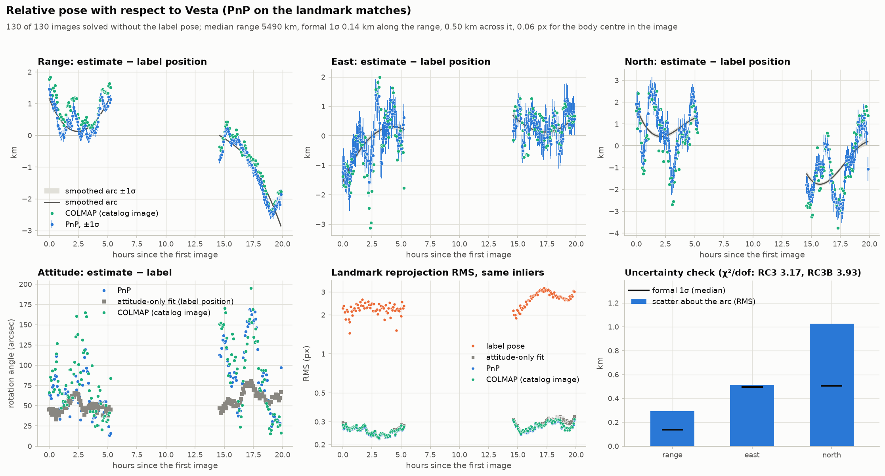

# asteroid-colmap

Download the Dawn Framing Camera images of Vesta's RC3 approach from the PDS and turn them into a
georeferenced **landmark catalog** using [COLMAP](https://github.com/colmap/colmap). The catalog
can then be used for navigation: the package finds its landmarks in new images by normalized
cross-correlation (NCC) and estimates each camera's position and attitude relative to Vesta, with
a covariance. It also writes figures for every stage.

```
PDS FITS + labels ─► 8-bit PNG + body masks ─► COLMAP SIFT / matching / mapping
                 ─► similarity fit to the label poses ─► body-fixed landmarks (Claudia″) ─► plots
curated landmarks ─► NCC maplets ─► new images: NCC matches + attitude fit ─► relative pose + arc
```

> **Hera or Dawn?** These images come from NASA's **Dawn** mission. ESA's Hera carries Framing
> Cameras built on the same Dawn FC heritage, but Hera never visited Vesta. RC3
> ("Rotational Characterization 3") is a Dawn Vesta approach sub-phase, flown on 24–25 July 2011.

<p align="center">
  
</p>

## The Vesta RC3 result

130 clear-filter (F1) images from FC2. Archive: `DWNVFC2_1B/DATA/FITS/2011123_APPROACH/`, sub-directories
`2011205_RC3` and `2011205_RC3B`. Each sequence covers one full Vesta rotation of 5.3 h from a range of
about 5,500 km, at 0.49 km/px. RC3 views latitudes 15° to 4° at a phase angle of 43° to 32°. RC3B views
latitudes −16° to −27° at a phase angle of 13° to 8°.

| | label-poses mode (default) | incremental mode (check) |
|---|---|---|
| registered images | 130 / 130 | 130 / 130 |
| landmarks (track ≥ 3) | 94,576 | 94,331 |
| grades A / B / C | 33,962 / 41,026 / 19,588 | 34,364 / 40,875 / 19,092 |
| curated set (one per 10 × 10 km cell) | 7,487 (A 6,384 / B 1,103) | 7,495 |
| observations | 824,085 | 829,685 |
| median track length / reprojection error | 6 / 0.24 px | 6 / 0.24 px |
| median triangulation angle | 34.5° | 34.7° |
| camera-centre residual vs label (RMS) | 2.15 km | 2.11 km |
| … along the line of sight / sideways (RMS) | 1.11 / 1.84 km | 1.07 / 1.82 km |
| attitude difference vs label (median) | 81″ | 74″ |
| landmark offset under the label poses (median) | 2.4 px | 2.4 px |
| COLMAP mapping time (CPU) | **30 s** | 226 s |

The camera residuals are kilometres, but they cost little in the image: under the label poses
the landmarks land 2.4 px (median) from where they are measured. A 5.5° camera at 5,500 km
barely sees a sideways shift or a change of range; see [Accuracy and caveats](#accuracy-and-caveats).

Each landmark is one surface feature: no two landmarks share a keypoint, and no landmark is measured
twice in one image (see the [duplicate-keypoint pitfall](#mapping-modes)). The two modes match 92,292
landmarks to each other through shared keypoints. The two catalogs differ by a common offset of about
0.10 km, and after removing it they agree to **16 m median and 46 m p90**. See
[Validation](#validation-two-independent-mapping-modes) below.

Heights above the 286.3 × 278.6 × 223.2 km ellipsoid range from −9.7 km (p5) to +8.3 km (p95).
99 % of the landmarks lie between 78°S and 46°N; the curated set reaches 89°S and 56°N. The north had
not been mapped yet because it was in polar night during the approach.

## Installation

```bash
pip install -e ".[interactive,dev]"     # Python >= 3.10; plotly for the 3-D HTML page, pytest
```

COLMAP is driven through its command-line interface, so you need the `colmap` binary:

```bash
brew install colmap                     # macOS
conda install -c conda-forge colmap     # any platform
sudo apt install colmap                 # Debian / Ubuntu
```

You can also build COLMAP from source and point `$COLMAP_BIN` or `--colmap` at the executable. The
results above were produced with COLMAP 4.2.0.dev0, CPU only. A GPU build (`--gpu`) speeds up feature
extraction and matching.

## Usage

```bash
asteroid-colmap run -w work              # download → prepare → reconstruct → catalog → plot
```

The same steps one at a time:

```bash
asteroid-colmap download    -w work      # 130 FIT + LBL (≈ 540 MB) and work/metadata.csv
asteroid-colmap prepare     -w work      # PNGs, feature masks, automatic orientation check
asteroid-colmap reconstruct -w work      # COLMAP (label-poses mode); --mode incremental
asteroid-colmap catalog     -w work      # work/catalog/*.csv, *.ply, summary.json
asteroid-colmap plot        -w work      # work/plots/*.png + pointcloud.html
asteroid-colmap info        -w work      # dataset, camera model and the latest summary
```

Navigation with the finished catalog (see [Navigation](#navigation-matching-new-images-to-the-catalog)):

```bash
asteroid-colmap templates -w work                                  # NCC maplets: work/catalog/templates.npz
asteroid-colmap match     -w work --name opnav022 --source vesta-opnav   # download OPNAV_022 and match it
asteroid-colmap match     -w work --name catalog --catalog-images  # or the catalog's own 130 images
asteroid-colmap pose      -w work --name opnav022                  # relative pose and smoothed arc
```

These options are the most useful (`asteroid-colmap <step> -h` lists the rest):

| option | step | effect |
|---|---|---|
| `--max-images N` | download | evenly sub-sample N images, for a quick test run |
| `--subdirs 2011205_RC3` | download | one sequence only |
| `--flip auto\|none\|ud\|lr\|rot180` | prepare | array orientation (auto picks `ud` for these FITS files) |
| `--mode label-poses\|incremental` | reconstruct | mapping strategy, see below |
| `--no-refine-poses` | reconstruct | keep the label poses fixed and only triangulate |
| `--matching pairs\|exhaustive\|sequential` | reconstruct | `pairs` (default) matches views less than `--max-view-angle` (40°) apart |
| `--skip-features` | reconstruct | reuse the feature database and re-run mapping only |
| `--spacing 10` | catalog | cell size (km) of the curated subset |
| `--size 31`, `--views 4` | templates | maplet width in samples, reference views per landmark |
| `--source DATASET` \| `--images DIR ...` \| `--catalog-images` | match | where the new images come from: a dataset to download (default `vesta-opnav`), folders of FIT + LBL pairs you already have, or the catalog's own images |
| `--name NAME` | match, pose | run folder under `work/navigation/` |
| `--min-ncc 0.8`, `--search 6`, `--coarse-search 20` | match | acceptance threshold, and search half-widths in pixels |
| `--estimate-position` | match | let the attitude fit move the position too (weak at these ranges; `pose` estimates it properly) |
| `--degree 2` | pose | polynomial degree of the smoothed arc |

On an Apple-silicon laptop with CPU-only COLMAP, feature extraction takes 0.8 min, matching 3.1 min, and
mapping 30 s in label-poses mode or 3.8 min in incremental mode. A workspace takes about 1 GB: the raw
FITS are 540 MB, the COLMAP database 190 MB, and the catalog 150 MB, most of it `observations.csv`.
Navigation adds about 10 s for the maplets, about 1.4 images/s for matching and a few seconds for
`pose`. The maplets take 74 MB, the OPNAV_022 download 60 MB, and `matches.csv` 8 MB for OPNAV_022
and 95 MB for the 130 catalog images.

## Pipeline

1. **download** reads the PDS directory listings and fetches the FIT and LBL files for the chosen
   filters in parallel. It then parses every PDS3 label into `metadata.csv` (time, quaternion,
   spacecraft vector, Sun vector, sub-spacecraft point, phase). The Vesta rotation model is checked
   against the label sub-spacecraft points, and agrees to better than 0.001°.
2. **prepare** stretches the calibrated radiance to 8-bit inside the body. It writes a feature mask
   that is eroded 8 px from the limb and the terminator, so that SIFT does not fire on the silhouette.
   It also detects the array orientation by comparing the observed lit disk with the disk predicted
   from the label geometry. The stored FITS rows are bottom-up, so `ud` is selected
   ([figure 03](examples/vesta_rc3/plots/03_orientation_check.png)).
3. **reconstruct** extracts DSP-SIFT features with the intrinsics held fixed, and keeps one keypoint
   per pixel. The OPENCV model comes from the instrument kernel: fx = 10716.2 px, fy = 10723.1 px,
   k1 = 0.189. Image pairs are chosen from the label viewing geometry, then matched with guided
   matching. Mapping uses one of the two modes below.
4. **catalog** fits a robust similarity transform (Umeyama, outlier-trimmed) from the COLMAP camera
   centres to the label spacecraft positions in the body-fixed frame. It keeps one observation per
   landmark and image, converts every point to km, latitude/longitude and height above the
   ellipsoid, then grades the points, picks a curated subset, and writes each observation in three
   pixel conventions.
5. **plot** writes 11 figures and an interactive Plotly point cloud.
6. **templates**, **match** and **pose** use the catalog for navigation; see
   [Navigation](#navigation-matching-new-images-to-the-catalog).

### Mapping modes

`label-poses` (default) seeds a COLMAP model with the PDS label poses and alternates
`point_triangulator` (poses fixed) with `bundle_adjuster` (poses and points refined), for two rounds.
This mode has three advantages:

- The model is born in the body-fixed frame and in km.
- It needs no initial image pair. With a 5.5° field of view the views are nearly affine, so two-view
  geometry is weakly conditioned.
- It is about 7× faster.

`incremental` runs COLMAP's standard `mapper` from scratch without any prior poses. The result is
tied to the body frame afterwards, by the same similarity fit used in the catalog step. This makes it
an independent check on both the label pointing and the label-poses catalog.

> **Narrow-angle pitfall.** COLMAP rejects any camera whose focal length is more than
> `Mapper.max_focal_length_ratio` (default 10) times the image size. It does this silently: the mapper
> reports "No good initial image pair found", and the triangulator returns an empty model. The Dawn FC
> ratio is 10.47, so every mapping call here raises the limit to 2 × the camera's ratio. Any
> narrow-angle camera, for example an OSIRIS-REx PolyCam, NEAR MSI or Hera AFC, hits the same wall.

> **Duplicate-keypoint pitfall.** SIFT gives a keypoint with two dominant gradient directions a second
> orientation, and stores it as a second keypoint at the same pixel. The copies can join different
> tracks, so one surface feature becomes two landmarks, typically about 0.5 km apart. COLMAP's covariant
> extractor, which it uses for DSP-SIFT and affine-shape SIFT, ignores
> `SiftExtraction.max_num_orientations`, so setting that option to 1 changes nothing. On RC3, 18 % of
> the keypoints were such copies, and half of the landmarks shared a keypoint with another landmark.
> The package therefore keeps one keypoint per pixel in the database after extraction. The catalog also
> keeps one observation per landmark and image, because COLMAP occasionally puts two distinct
> keypoints of one image, a few pixels apart, in the same track.

## Catalog files

All files are written to `<workdir>/catalog/`. Example copies from the RC3 run are in
[examples/vesta_rc3/](examples/vesta_rc3/). The two largest files are not included there.

| file | content |
|---|---|
| `landmarks.csv` | every point with track ≥ 3: `landmark_id`, `x/y/z_km`, `lat/lon_deg`, `radius_km`, `height_km`, `track_length`, `reproj_error_px`, `max_tri_angle_deg`, `mean_range_km`, `gsd_km`, `gray`, `grade`, `outlier` |
| `landmarks_curated.csv` | the best grade A/B landmark per equal-area 10 km cell (7,487 for RC3) |
| `observations.csv` | one row per (landmark, image), described below |
| `cameras.csv` | per image: geometry from the label, registration, landmark count, reprojection RMS, the aligned COLMAP pose (`sfm_x/y/z_km` and `sfm_qw/qx/qy/qz`, the scalar-first quaternion of the body-fixed → camera rotation), the landmark offset under the label pose (`label_offset_u/v_px`, median of projection − measurement, and its length `label_offset_px`), and the residuals relative to the label: `position_residual_km` split into `position_range_km` (+ = COLMAP farther from the body), `position_east_km`, `position_north_km` and `position_lateral_km`, then `attitude_residual_deg`, `boresight_du/dv_px` and `twist_deg` |
| `landmarks.ply` | point cloud in km, body-fixed (for MeshLab or CloudCompare) |
| `summary.json` | counts, alignment statistics (with `position_range_rms_km`, `position_lateral_rms_km` and `boresight_median_px`), the landmark offset under the label poses (`label_pointing_offset_median_px`, and the median (u, v) per sequence in `label_pointing_offset_by_sequence_px`), the similarity transform, and the COLMAP version |
| `templates.npz` | written by `templates`: the NCC maplet of every curated landmark (not in the examples, 74 MB) |

Each row of `observations.csv` holds:

- `u, v`: COLMAP pixel coordinates in the oriented PNG; the image corner is 0 and the first pixel centre is 0.5.
- `sample_ik, line_ik`: 0-based pixel-centre coordinates in the instrument-kernel frame.
- `fits_col, fits_row`: the same point as indices into the stored FITS array.
- `residual_u/v_px`: reprojection residuals.
- `label_pred_du/dv_px`: the offset from the position predicted by the label pose.
- `emission_deg`, `incidence_deg`.

**Frames.**

- Positions are in Vesta's IAU 2015 "Claudia double-prime" body-fixed frame:
  pole RA/Dec 309.031°/42.235°, W0 = 285.39°, planetocentric latitude, east-positive longitude in
  [0°, 360°). This is the frame the Dawn FC PDS labels use. The older `dawn_vesta_v04.tpc` "Claudia"
  frame has W0 = 75.39°, which is off by 210°.
- Landmark grades:
  - **A**: track ≥ 8, angle ≥ 15°, error ≤ 1 px.
  - **B**: track ≥ 4, angle ≥ 5°, error ≤ 2 px.
  - **C**: everything else.
- `outlier` means |height| > 60 km.

## Figures

All figures share one house style, applied inside each plot call, so importing the package does not
change your matplotlib settings. Height above the ellipsoid always uses the same diverging
blue-white-red scale, centred on 0 km.

| figure | content |
|---|---|
| `01_montage` | prepared input frames, evenly spaced in time |
| `02_geometry` | sub-spacecraft ground track with the polar-night band; range and phase against hours since sequence start |
| `03_orientation_check` | observed silhouettes against the label-predicted lit ellipsoid, for every flip |
| `04_features` | landmark observations on the best-connected image of each sequence |
| `05_covisibility` | landmarks shared by every image pair |
| `06_alignment` | per image, relative to the label poses: position residual along the line of sight and sideways, pointing difference at the boresight and at the landmarks, and twist |
| `07_pointcloud` | four orthographic globe views of the landmarks, coloured by height |
| `08_landmark_map` | equirectangular map by height, curated subset by track length, and a south-polar view of Rheasilvia |
| `09_quality` | track length, reprojection error, triangulation angle and height, stacked by grade, with the grade thresholds |
| `10_radius_vs_latitude` | height against latitude as a log-density hexbin, with the median and quartiles per 5° band |
| `11_landmark_chips` | image patches of grade A landmarks across their views |
| `pointcloud.html` | rotatable Plotly point cloud (needs the `interactive` extra) |

<p align="center">
  
</p>
<p align="center">
  
  
</p>

## Navigation: matching new images to the catalog

Three commands turn the catalog into a navigation map and use it on images that were not part of
the reconstruction.

1. **`templates`** builds a *maplet* for each curated landmark, as in stereophotoclinometry. A
   maplet is a 31 × 31 grid of heights on the landmark's tangent plane, at the catalog's median
   ground sample distance (0.492 km). Its normal and heights are smoothed from the neighbouring
   landmarks. The maplet also stores the landmark's brightness in up to four catalog images, chosen
   to spread the Sun directions as widely as possible. 6,823 of the 7,487 curated landmarks get a
   maplet, with 3.9 views on average.
2. **`match`** predicts every visible landmark in a new image from the label pose. It renders each
   landmark from the reference view whose Sun direction is closest (within 30°), by intersecting
   each pixel's ray with the height grid, and searches for it by masked NCC. There are three
   passes:
   1. 160 high-contrast landmarks are searched over ±20 px, to remove the label's pointing error.
   2. Every visible landmark is searched over ±6 px. A match is accepted when its NCC peak is at
      least 0.8 and leads the runner-up peak by at least 0.1. A robust attitude fit follows.
   3. The landmarks are rendered again at the fitted attitude, searched over ±3 px, and the
      attitude is fitted again.

   The position is held at the label's. The result is a pixel measurement of every matched
   landmark and a corrected attitude for each image, with its covariance.
3. **`pose`** estimates the full pose, position and attitude, from the matches alone:
   1. POSIT inside RANSAC (12-point samples, 2 px threshold) gives a starting pose without the
      label and rejects wrong matches.
   2. A robust least-squares fit of the six parameters, with σ = 0.3 px per measurement, gives the
      pose and its 6 × 6 covariance. When the post-fit χ²/dof exceeds 1, the covariance is scaled
      up by it.
   3. A weighted polynomial through each sequence's positions in J2000 (degree 2 by default) gives
      a smoothed arc. Its χ²/dof tests whether the formal covariances match the scatter.

   Each pose is compared with the label pose, with the attitude-only fit of `match`, and, for the
   catalog images, with the COLMAP pose.

The matching searches around the label prediction, so it needs an a priori pose. The pose
solution does not.

### Results

Two runs are committed in [examples/vesta_rc3/navigation/](examples/vesta_rc3/navigation/), without
`matches.csv`:

* **`opnav022`**: the 15 clear-filter images of the optical-navigation sequence OPNAV_022
  (2011-07-31, a week after RC3, about 4,000 km, 0.35 km/px). None of them is in the catalog. The
  `vesta-opnav` dataset downloads them.
* **`catalog`**: the 130 catalog images. Each one is matched without its own reference views, so the
  result can be compared with the COLMAP poses.

| | `opnav022` | `catalog` |
|---|---|---|
| images with a pose | 15 / 15 | 130 / 130 |
| landmarks searched / accepted / inliers | 19,691 / 15,715 / 14,858 | 233,086 / 182,055 / 176,544 |
| inliers per image (median) | 994 | 1,368 |
| median NCC of the inliers | 0.976 | 0.965 |
| RMS at the label pose → after the attitude fit | 5.21 → 0.334 px | 2.38 → 0.269 px |
| attitude correction (median) | 103″ (5.2 px) | 53″ (2.4 px) |
| corrected attitude vs COLMAP: landmark reprojection | – | 0.076 px median, 0.148 px max |
| relative pose: RMS | 0.326 px | 0.263 px |
| relative pose: 1σ range / east / north (median) | 0.10 / 0.37 / 0.36 km | 0.14 / 0.50 / 0.51 km |
| relative pose: body-centre pixel 1σ (max) | 0.09 px | 0.07 px |
| estimate − label, RMS range / east / north | 0.67 / 1.32 / 1.93 km | 1.07 / 0.71 / 1.46 km |
| estimate − COLMAP, RMS range / east / north | – | 0.33 / 0.66 / 0.72 km |
| attitude − label / − COLMAP (median) | 219″ / – | 68″ / 35″ |
| smoothed arc: χ²/dof (degree 2) | 1.06 | RC3 3.17, RC3B 3.93 |

**What is well determined.** The range comes from the apparent size of the landmark pattern, and is
the best-determined direction: about 0.1 km at 4,000–5,500 km. Sideways, a small shift of the
camera looks almost like a small rotation, and only the depth relief of the visible surface
separates the two. So the east and north 1σ are 3–4 times larger, and the lateral error trades
against the attitude error. This is the same weak mode as in the catalog's alignment (see
[Accuracy and caveats](#accuracy-and-caveats)). The pixel where the body centre appears
(`target_u_px`, `target_v_px`) stays well determined, to better than 0.1 px.

**Reading the comparisons.**

* **Against the label.** The estimates differ from the label by 1.5–3 km. The label pose fits the
  measured landmarks 6–18 times worse than the estimate, so these differences are mostly label
  error.
* **Against COLMAP.** The two agree to 0.3 km in range and 0.7 km sideways, with a median attitude
  difference of 35″. The sideways part is the weak mode.
* **The χ²/dof of the arc.** For OPNAV_022, over 1.2 hours, the χ²/dof is about 1, so the formal
  covariances match the scatter. RC3 and RC3B each last 5.25 hours, about one Vesta rotation. Their
  χ²/dof is 3.2 and 3.9 with a quadratic arc, and falls to 1.2 and 0.8 with a degree-8 arc. Over
  5 hours the spacecraft's path is close to a straight line, so the higher-degree terms are not
  following the spacecraft. They absorb an error in the estimates that changes smoothly as
  different sides of Vesta come into view, most likely from the catalog itself. In the range and
  north directions the arc residuals are about twice the single-image 1σ; east is close to 1σ.
  Over a full rotation, double the range and north 1σ. The smoothed arc's 1σ in
  `trajectory.csv` is formal: multiply it by √(χ²/dof).

### Output files

Each run is written to `<workdir>/navigation/<name>/`:

| file | content |
|---|---|
| `metadata.csv` | label geometry of the new images, as for the catalog |
| `matches.csv` | one row per searched (image, landmark): a priori and measured pixel (`u_apriori`, `v_apriori`, `u`, `v`, and the same point in the `sample_ik, line_ik` and `fits_col, fits_row` conventions), `ncc` and the runner-up `ncc_second`, `accepted`, `inlier`, post-fit `residual_u/v_px`, the reference view used and its Sun-direction difference, emission, incidence, range |
| `poses.csv` | per image: landmarks searched, accepted and kept; the pass-1 shift; median NCC; pre-fit and post-fit RMS; the boresight correction `du_px, dv_px`, `twist_deg` and `correction_arcsec`; the corrected attitude `qw..qz` and its 1σ `sigma_rx/ry/rz_arcsec`; the position `x/y/z_km` (the label's unless `--estimate-position`). With `--catalog-images`, also the RMS distance to the landmarks projected with the COLMAP pose: of the NCC measurements (`sfm_measurement_rms_px`), the corrected pose (`sfm_estimate_rms_px`) and the label pose (`sfm_apriori_rms_px`) |
| `relative_pose.csv` | per image, from `pose`: body-fixed position `x/y/z_km` and attitude `qw..qz`; the same in J2000 (`j2000_*`); the sub-spacecraft point; the body-centre pixel `target_u/v_px` and its 1σ; the 1σ along range, east and north and about the three camera axes; the position covariance `cov_xx..zz_km2`; and the differences from the label (`*_minus_label_*`), from the attitude-only fit (`*_ncc_*`) and, for the catalog images, from COLMAP (`*_sfm_*`) |
| `trajectory.csv` | per image: the smoothed position, its formal 1σ along range, east and north, the residual about the arc, the arc's `chi2_dof`, and smoothed minus label |
| `summary.json` | `matching` and `relative_pose` blocks: counts, medians and the options used |
| `plots/` | the five figures below |

All attitudes are scalar-first quaternions of the body-fixed → camera rotation (camera x right,
y down, z along the boresight). Positions are body-fixed km unless marked J2000.

| figure | content |
|---|---|
| `01_matches` | every searched landmark on one image, coloured by NCC (rejected ones in grey), and a true-scale zoom with arrows from the a priori to the measured position |
| `02_chips` | eight landmarks across the NCC range: the maplet, the rendering at the estimated pose, and the image at the estimated and at the a priori pose |
| `03_residuals` | measured − a priori (a common shift is a pointing error), measured − estimated, and the density of the post-fit residuals |
| `04_navigation` | per image: the boresight correction, the pre-fit and post-fit RMS, the landmarks searched, accepted and kept, and the median NCC |
| `05_relative_pose` | range, east and north minus the label with ±1σ and the smoothed arc; attitude minus the label for both fits; RMS for the label, attitude-only and 6-parameter fits; scatter against the formal 1σ |

<p align="center">
  
</p>
<p align="center">
  
  
</p>

## Notebook

[notebooks/test_everything.ipynb](notebooks/test_everything.ipynb) checks the whole package in one
place. It:

* runs the unit tests;
* exercises the camera, rotation model, label parser and grading;
* recomputes the catalog invariants, the alignment statistics, the duplicate-keypoint checks and the
  mode comparison from the CSV files;
* redraws every figure;
* checks the maplets, the NCC matches of the two navigation runs, and the relative poses and their
  covariances.

Each check prints `✓` or `✗`, and the last cell fails if any check failed.

The notebook reads the workspace named by `ASTEROID_COLMAP_WORKDIR`, or `work/` if that exists. If
the second-mode catalog is in `ASTEROID_COLMAP_OTHER` or `work_inc/`, it compares the two modes
directly; otherwise it checks the stored RC3 comparison. Without a workspace it falls back to the
RC3 results in `examples/vesta_rc3`: no download and no COLMAP needed, but only the checks that the
curated subset supports. Set `RUN_PIPELINE = True` in its first code cell to run the full pipeline
from the notebook, and `RUN_NAVIGATION = True` to build the maplets and redo both navigation runs
(about 3 minutes plus the 60 MB download, on top of a finished catalog).

```bash
pip install -e ".[notebook,interactive]"
jupyter lab notebooks/test_everything.ipynb
# or headless, saving the outputs into the notebook:
jupyter execute --inplace notebooks/test_everything.ipynb
```

The committed copy was run on the full RC3 workspace with both navigation runs, where all 103 checks
pass. With only the committed examples, 80 checks run and pass.

## Validation: two independent mapping modes

Both modes start from the same feature database, so their landmarks can be matched through the
keypoints they share:

```bash
mkdir -p work_inc/colmap
cp -R work/images work/masks work/metadata.csv work/prepare.json work_inc/
sqlite3 work/colmap/database.db ".backup work_inc/colmap/database.db"
asteroid-colmap reconstruct -w work_inc --mode incremental --skip-features
asteroid-colmap catalog     -w work_inc
asteroid-colmap compare     -w work --other work_inc
```

The RC3 results are in [compare_incremental.json](examples/vesta_rc3/compare_incremental.json):

- 92,292 of about 94,500 landmarks are matched.
- The 3-D distance between matched landmarks is 98 m median and 124 m p90.
- Nearly all of that distance is a common offset of (31, 94, −15) m. After removing it, the distance
  is **16 m median and 46 m p90**.
- The height difference is 12 m median and 96 m |p90|.

Shape is therefore reproducible to a few tens of metres, a small fraction of the 490 m pixel. The
absolute position is set by how each mode is tied to the labels.

## Accuracy and caveats

- **Absolute position is about 1 km.** The catalog frame is tied to the PDS label poses.
  Triangulating the same tracks with the label poses held fixed gives a cloud that sits about
  1.1 km along the pole from the catalog; take that as the size of the frame uncertainty. The two
  mapping modes agree to 0.10 km because both are tied to the same labels, so their agreement
  measures shape, not absolute position.
- **Camera residuals of kilometres are expected.** A 5.5° camera at 5,500 km barely sees two
  motions:
  - moving sideways while turning to keep Vesta centred. A 2 km swing moves the boresight by
    3.9 px but the landmarks by only 0.1 px (median; 0.2 px max).
  - moving along the line of sight. 2 km changes the image scale by 0.04 % and moves the
    landmarks by about 0.2 px.

  The 2.15 km position RMS splits into 1.11 km along the line of sight and 1.84 km sideways. The
  sideways part follows the boresight offset (3.7 px median, the 81″ attitude difference), so treat
  the refined camera poses as a consistent pair, not as independent estimates. The range part
  drifts smoothly over each sequence, between −2.5 and +1.8 km, at a cost of less than 0.2 px.
- **The label pointing is biased by about 2.4 px.** Under the label poses the landmarks land
  2.4 px (46″) median from where they are measured. The offset is nearly constant within a
  sequence, a median (u, v) of (−2.0, −1.0) px in RC3 and (+0.7, −2.5) px in RC3B, and the
  incremental mode, which never uses the label poses, finds the same values. It is a pointing (or
  principal-point) bias of the labels that differs between the two sequences, not a catalog error.
- **Coverage is limited by lighting.** Only the sunlit southern and equatorial terrain is mapped; the
  north was in polar night. Later Dawn phases (Survey, HAMO, LAMO) fill the gaps, and the archive
  layout and labels are the same.
- **Landmarks are SIFT points; the maplets are added afterwards.** Each catalog landmark is a 3-D
  point with a track. `templates` builds a local height grid and reference images around it, but not
  an albedo and slope model as stereophotoclinometry does. A landmark is therefore searched only
  when one of its reference views has a Sun direction within 30° of the new image's. Images under
  lighting very different from RC3 and RC3B find fewer landmarks.
- **Navigation inherits the weak mode.** The relative pose separates range (about 0.1 km) well, and
  lateral position from pointing only to 0.4–0.5 km. Over a full rotation the scatter is about
  twice the formal 1σ in range and north (see [Results](#results)).
- `--max-view-angle` (40°) and the 8-px mask erosion are tuned for this approach geometry. Closer
  phases need smaller angles or `--matching exhaustive`.

## Other datasets

A new phase or target needs one `Dataset` entry in
[src/asteroid_colmap/config.py](src/asteroid_colmap/config.py): the archive URL, sub-directories,
body rotation model and ellipsoid, and camera key. Ceres RC3 (`DWNCFC2_1B`) uses the same camera,
label keywords and directory layout. A different camera also needs a `FramingCamera` entry in
[camera.py](src/asteroid_colmap/camera.py). The `vesta-opnav` entry, the OPNAV_022 sequence used for
navigation, is an example of a dataset that only provides new images for `match`.

## Why COLMAP rather than NASA GIANT

[docs/ENGINE_EVALUATION.md](docs/ENGINE_EVALUATION.md) compares the two engines. In short, COLMAP
builds landmarks from images alone. GIANT's landmark navigation (SFN), and its template mode of
constraint matching, start from a shape model or DEM that this dataset does not yet have. GIANT is
the natural *consumer* of a catalog like this one, for relative OpNav, star-based attitude and camera
calibration. It is not the tool that builds the catalog.

## Tests

```bash
pytest -q        # 59 tests, < 2 s, no network and no COLMAP needed
```

The tests cover:

- PDS3 label parsing on a real RC3 label;
- quaternion and rotation conventions;
- the Vesta rotation model, checked against the label's sub-spacecraft point to 1e-3°;
- the camera projection round trip and pixel-frame conversions;
- COLMAP TXT model I/O;
- the label-pose seed model;
- the one-keypoint-per-pixel database clean-up and the one-observation-per-image rule;
- pair selection;
- landmark grading, equal-area cells and catalog comparison;
- masked NCC maps, sub-pixel peaks and the runner-up peak;
- the attitude fit with outliers, maplet save and load, and the maplet tangent planes;
- POSIT, RANSAC PnP and the six-parameter fit, including a covariance that matches the scatter of
  30 noisy trials;
- the smoothed arc's χ²/dof and smoothing.

## Credits

- **Data:** Dawn FC2 calibrated images, PDS Small Bodies Node
  (<https://sbnarchive.psi.edu/pds3/dawn/fc/>). Sierks et al. (2011), *The Dawn Framing Camera*,
  Space Sci. Rev. 163, 263–327.
- **Rotation model:** Archinal et al. (2018), IAU WGCCRE 2015.
- **Ellipsoid:** Russell et al. (2012), Science 336, 684.
- **COLMAP:** Schönberger & Frahm (2016), *Structure-from-Motion Revisited*, CVPR.
